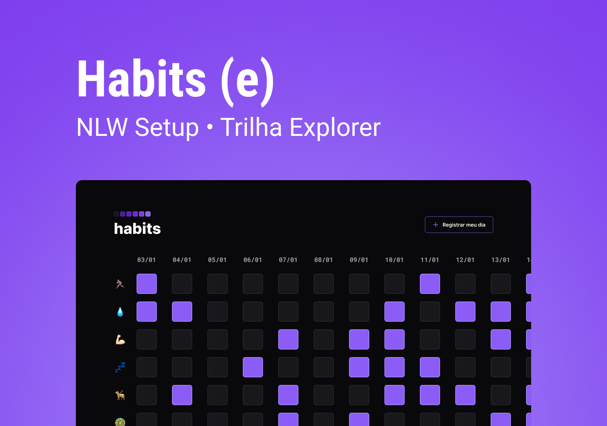

<h1 align="center"> Habits </h1>

O Habits é um programa criado para o acompanhamento de hábitos diários de forma rápida e fácil.  

  <a href="#-tecnologias">Tecnologias</a>&nbsp;&nbsp;&nbsp;|&nbsp;&nbsp;&nbsp;
  <a href="#-projeto">Projeto</a>&nbsp;&nbsp;&nbsp;|&nbsp;&nbsp;&nbsp;
  <a href="#-layout">Layout</a>&nbsp;&nbsp;&nbsp;|&nbsp;&nbsp;&nbsp;
  <a href="#memo-licença">Licença</a>

 

  

## 🚀 Tecnologias

Esse projeto foi desenvolvido com as seguintes tecnologias:

- HTML e CSS
- JavaScript
- Git e Github
- Figma

## 💻 Projeto

O Habits é um app web que ajuda a acompanhar os hábitos.

<!-- - [Acesse o projeto finalizado, online](https://maykbrito.github.io/devlinks) -->

## 🔖 Layout

Você pode visualizar o layout do projeto através [DESSE LINK](<https://www.figma.com/file/vKiEkoSo2GFqp22yips0F7/Habits-(e)-(Community)?node-id=6%3A910&t=c902wNHVCRR7xaBc-1>). É necessário ter conta no [Figma](https://figma.com) para acessá-lo.

---
